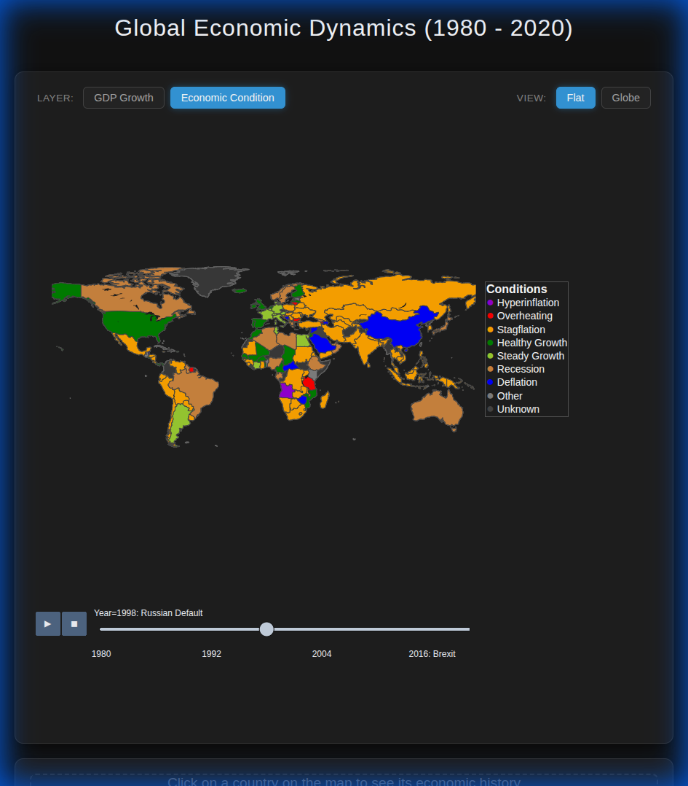

# 🌍 Great Economist: Global Dynamics (1980-2020)

[](https://www.python.org/)
[](https://plotly.com/)
[](https://opensource.org/licenses/MIT)

An interactive visual exploration of global economic history. This project transforms raw GDP and Inflation data into a dynamic dashboard, revealing the patterns of growth, recession, and economic crises across four decades.



## Project Objective

The **Great Economist** project aims to provide a clear, interactive view of how the world's economies have evolved. By combining multiple data sources, it allows users to:
- **Visualize** global trends through an animated choropleth map.
- **Identify** economic conditions like **Stagflation**, **Hyperinflation**, and **Healthy Growth**.
- **Analyze** country-specific histories with interactive line charts.
- **Relate** data to historical events (e.g., 2008 Financial Crisis, COVID-19).

## Data Engineering & Manipulations

The project processes large-scale datasets to derive meaningful economic indicators.

### 1. Data Sources
- **GDP Data**: Global GDP figures from 1960 to 2020 (World Bank via Kaggle).
- **Inflation Data**: Annual inflation rates by country (Kaggle).

### 2. Processing Pipeline
The [data_processor.py](file:///mnt/disk_d/projects/great_economist_project/data_processor.py) script performs the following:
- **Standardization**: Mapped inconsistent country names (e.g., "the United States" ➔ "United States") and assigned **ISO-3 Alpha codes** for accurate map rendering.
- **Merging**: Unified GDP and Inflation data into a single temporal dataset (1980-2020).
- **Feature Engineering**:
    - **Real GDP Growth**: Calculated by adjusting nominal growth for inflation.
      > **Formula**: `Real Growth = ((1 + Nominal Growth/100) / (1 + Inflation/100) - 1) * 100`
    - **Economic Condition Classificator**: A custom heuristic to categorize country states:
        - 🟣 **Hyperinflation**: Inflation > 100%
        - 🔴 **Overheating**: Inflation > 5% & Real Growth > 5%
        - 🟠 **Stagflation**: Inflation > 5% & Real Growth < 1%
        - 🟢 **Healthy Growth**: Low Inflation & High Growth (> 3%)
        - 🟤 **Recession**: Real Growth ≤ 0%
        - 🔵 **Deflation**: Inflation < 0%

## Getting Started

### Prerequisites
```bash
pip install pandas plotly pycountry kagglehub
```

### Usage
1. **Download Data**: Run `python visualizer.py` to fetch the latest datasets.
2. **Process Data**: Run `python data_processor.py` to clean and merge the datasets.
3. **Generate Map**: Run `python map_generator.py` to create the interactive dashboard.
4. **View**: Open `interactive_economic_map.html` in your browser.

## Results

The output is a robust **Interactive Economic Dashboard** featuring:
- **Switchable Layers**: Toggle between "Real GDP Growth" and "Economic Condition" views.
- **Dual View Modes**: Switch between a **Flat Map** and a **3D Globe**.
- **Contextual Markers**: The timeline slider highlights major global events like the **Asian Crisis (1997)** and **Brexit (2016)**.
- **Deep Dive**: Click on any country to immediately generate a historical comparison chart of its GDP Growth vs. Inflation.


